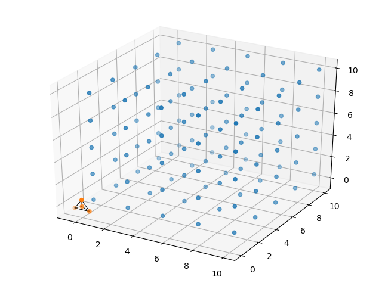
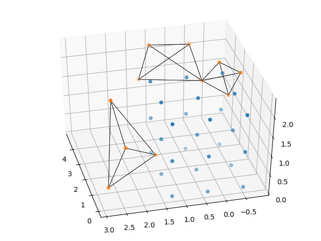

# Introduction
Acoustic tracking is a common method used to study vocalising animals such as birds and echolocating animals like bats and cetaceans [@suzuki2017harkbird;@aubauer1996acoustical;@mohl2000sperm;@Goerlitz2010;@Hugel2017;@Lewanzik2018].
Using acoustic tracking, biologists can detect the position of the animal, its identity and track it through space as it moves across time. The localisation accuracy of an acoustic tracking system depends on a variety  of factors. There are *internal* factors such as microphone array geometry,
signal processing routines, and the mathematical formulations used to localise sounds (time-of-arrival, time-of-arrival-difference, angle-of-arrival, power-steering). The *external*
factors include aspects related to the actual signal itself, ie. signal-to-noise ratio, and spectro-temporal properties of the emitted sound (noise, linear/hyperbolic sweep) [@Wahlberg1999]. 
While experiments may be the definitive way to determine a tracking system's end accuracy, simulations allow  a quick and systematic method to estimate the source of tracking errors. 
`tacost` provides a flexible workflow to manipulate and study the effect of both internal and external factors. 

# Statement of need
Generating simulated audio for a set of source sounds and a given array configuration is a relatively simple task. However, to this author's knowledge, there 
are no publicly available, tested and documented packages published to date. Codebases that are publicly available have the advantage of being used by a larger user-base and can thus 
benefit from bug discoveries much faster than in-house or individually written one-time use scripts.  `tacost` provides a robust and well-documented software workflow [@Taschuk2016]  with user 
and developer friendly documentation [hosted online](https://tacost.readthedocs.io/en/latest/). `tacost` contributes to the Python scientific ecosystem and hopes to promote the growth of acoustics and 
bioacoustic research in open-source languages like Python. 

# Design 
The design of `tacost` focusses on a reproducible and user-friendly method [@Wilson2012] to generate WAV files that form the input for acoustic tracking softwares. Users may interact with `tacost` through custom-written Python scripts
by calling it as a Python package with ```import tacost``` or in the 'no-coding' mode. For those unfamiliar with Python, the 'no-coding' mode is based around a parameter file which is used to specify various parts of the actual simulated WAV file to be created.
Through the parameter file the user can define the emitted sound, positions, inter-sound-intervals, sampling rate and other relevant variables to customise the output WAV file.
`tacost` will help researchers working in the field of acoustics and bio-acoustics plan and examine the behaviour of their acoustic tracking systems. 

# Examples

A microphone array's localisation accuracy may not be uniform over 3D space [@aubauer1996acoustical;@Wahlberg1999]. This accuracy is independent of the actual signal and recording conditions of the input data, but rather dependent on the mathematical formulations and array geometry used to calculate source sound position.
While the accuracy of a few microphone array configurations have been characterised [@aubauer1996acoustical;@Wahlberg1999], the characterisation of an array's accuracy is a manually-intensive task.
The intrinsic accuracy of arrays can be relatively quickly characterised by the use of audio files with simulated emission points spread across the recording volume of interest. 
'tacost' can be used to characterise the maximal localisation accuracy of an acoustic tracking system with novel array geometries and recording scenarios. 

## Localisation accuracy of the tristar60 system
The tristar60 array is a commonly used array geometry [@Hugel2017;@Lewanzik2018] with 4 microphones in a plane on an inverted T array. Three peripheral microphones are placed 120$^{\circ}$ to
each other at 60 cm distance from the central mic on this inverted T-array. The output WAV files from `tacost` were run through the TOADSuite package [@holger_toadsuite_manual;@toadsuite_peterstilz], a 
software package that localises sounds using the time-of-arrival-differences across channels. \autoref{Figure 1} shows the localisation accuracy map 
for the tristar60 microphone array. It can be seen that localisation accuracy drops with radial distance from the array, and that there is a SOMETHINGSEOMTHINGSEOMTHING. It must be kept in mind that the resulting outputs are a combined output of multiple factors, and not 
only the result of the microphone array geometry. 




## Localisation accuracy of a multi-microphone array in the field 
While recording in the field, it may be difficult to use fixed arrays mounted on stands. These arrays are difficult to carry and may also influence the behaviour of the animals themselves. It is advantageous to 
use less obtrusive micorphone geometries, for instance where the microphones are placed on the walls of a cave or on trees. These microphone geometries are flexible, but their localisation accuracy is hard to 
characterise analytically. `tacost` is an ideal tool for such situations. \autoref{Figure 2} shows the microphone array geometry and recording system described in [@Batstone2019].In short, the array consisted of 12 microphones, 4 of them on a 120cm tristar, and 
the remaining 8 microphones attached to the walls of a cave. A series of sound emission points were created simulating the volume that echolocating bats flew within. The simulated sound was set to 
a linear sweep, which mimicked that of a bat call. The `tacost` output WAV files were analysed with the TOADSuite. A series of illustrative experiments were run to investigate the effect of 1) error in microphone position specification 
and 2) type of signal. The resulting accuracy map reveals that overall, the SOMETHINGSEOMTHINGSEOMTHING SOMETHINGSEOMTHINGSEOMTHING 
SOMETHINGSEOMTHINGSEOMTHING




# Acknowledgements
This work was supported by a doctoral fellowship from the German Academic Exchange Service (DAAD) and the International Max Planck Research School for Organismal Biology. 
I would like to thank Lena De Framond for generating the acoustic localisation output, Holger R Goerlitz for helpful discussions and the IT team at the Max-Planck Institute for Ornithology for their support. 

# References